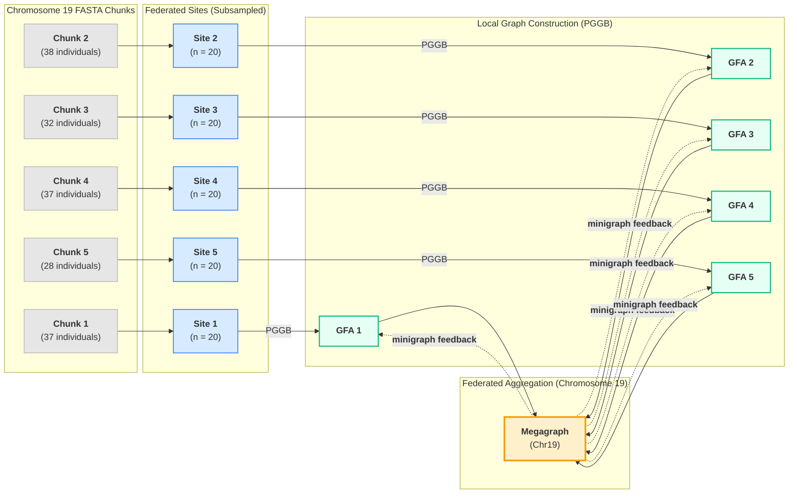

> **CMU × NVIDIA Hackathon — January 7–9, 2026**


# OmniGenome  
### Federated Pangenomes & Genomic Background Modeling


---

## 🧠 Problem & Motivation

Pangenomes offer a powerful alternative to single-reference genomes by representing genetic variation across many individuals. However, **current pangenome graphs typically include only tens of samples**, while modern biobanks (UK Biobank, All of Us, HPRC) now contain **thousands of long-read genomes** spanning diverse populations.

A major barrier remains:

> **There is no practical way for independent biobanks to collaboratively construct population-scale pangenomes without sharing raw genomic data.**

This leads to:
- Silos across cohorts  
- Persistent population bias  
- Limited downstream interpretability  

---

## 🎯 Project Vision

**OmniGenome** explores whether **federated learning principles** can be applied to pangenome construction and genetic association analysis.

Instead of sharing raw FASTA files, participating sites:
- Build **local pangenome graphs**
- Share **graph representations only**
- Aggregate information *per chromosome*

We demonstrate this idea through:
1. **Federated pangenome graph construction** (HPRC)
2. **Genomic background hashing** for phenotype association at the **APOE locus**

---

## 🚀 Quick Start (Demo)

This quick start runs a **single local PGGB job** to demonstrate the core building block used throughout the project.

### Prerequisites
- Docker (with Compose)
- ~8 GB RAM
- bgzip-compatible FASTA input

### Run Example

```bash
# Start Docker
systemctl start docker

# Build containers
docker compose build

# Run PGGB on an example FASTA
docker compose run pggb pggb \
  -i /data/input.fa.gz \
  -o /output/my_graph \
  -n 12 \
  -t 8 -p 90 -s 10000
```

> ⚠️ FASTA files **must be bgzip-compressed**, not gzip.

This produces a local **GFA pangenome graph**, which is the unit shared in the federated workflow.

---

## 🧬 Project Overview

### Two Complementary Components

#### 1️⃣ Federated Pangenome Construction  
Simulates how multiple biobanks can collaboratively build pangenomes while keeping raw genomic data local.

#### 2️⃣ Genomic Background Hashing (APOE Case Study)  
Uses localized pangenome context to encode anonymized haploblock structure for federated association analysis.

Together, these form an end-to-end framework for **privacy-preserving, population-scale pangenomics**.

---

## 🧬 High-Level Architecture



---

## 🔬 Component 1: Federated Pangenome Graph Construction

### Data
- **Human Pangenome Reference Consortium (HPRC)**
- Chromosomes **19** and **22** (tractable proof-of-principle)

### Core Idea

Each simulated “site”:
- Holds private FASTA data
- Builds a **local pangenome graph** using PGGB
- Shares only the resulting **GFA graph**

Graphs are then:
- Aggregated **per chromosome**
- Used to refine local graphs iteratively

> ⚠️ Graphs are **never combined across chromosomes**

---

### Minimal Pipeline Summary

1. Download HPRC assemblies  
2. Extract chr19 / chr22  
3. Subsample individuals to simulate biobank cohorts  
4. Run PGGB locally  
5. Aggregate graphs with `vg combine`  
6. (Optional) Feedback using `minigraph`

---

### Example: Local Graph Construction

```bash
docker compose run pggb pggb \
  -i /data/input.fa.gz \
  -o /output/run_name \
  -n 20 \
  -t 8 -p 90 -s 10000
```

---

## 🧬 Component 2: Genomic Background Hashing (APOE)

To demonstrate downstream utility, we focus on the **APOE locus**, a major genetic risk factor for Alzheimer’s disease.

### Motivation

GWAS hits often lack genomic context:
- Identical risk alleles can appear in different haplotypic backgrounds
- These backgrounds may influence penetrance or downstream effects

Pangenomes provide a natural representation of this structure.

---

### Workflow

1. Identify APOE-associated loci from GWAS summary statistics  
2. Extract the corresponding pangenome subgraph  
3. Encode **anonymized haploblock structure** as hashes  
4. Use hashes as a federated genomic background feature  

This enables:
- Privacy-preserving association testing  
- Context-aware interpretation of risk alleles  
- Cross-cohort comparison without raw genotype sharing  

---

## 🧰 Key Tools

| Tool | Role |
|-----|-----|
| **PGGB** | Local pangenome construction |
| **vg** | Graph conversion & aggregation |
| **minigraph** | Incremental graph feedback |
| **odgi** | Graph slicing & analysis |
| **Docker** | Reproducibility |

---

## 👥 Team

**CMU × NVIDIA Hackathon 2026**

- Rob Loughnan  
- Adam Kehl  
- Jedrzej Kubica  
- Kumar Koushik Telaprolu  
- **Jeff Winchell**  
- Sanjnaa Sridhar  

---

## 📚 References

- Wightman DP *et al*. *Nature Genetics* (2021)  
- Garrison E *et al*. *Nature Methods* (2024)  
- Garrison E *et al*. *Nature Biotechnology* (2018)  
- Guarracino A *et al*. *Bioinformatics* (2022)  
- Sirén J *et al*. *Science* (2021)  
- Liao W-W *et al*. *Nature* (2023)  
- Li H *et al*. *Genome Biology* (2020)

---

## 📄 License

MIT License
