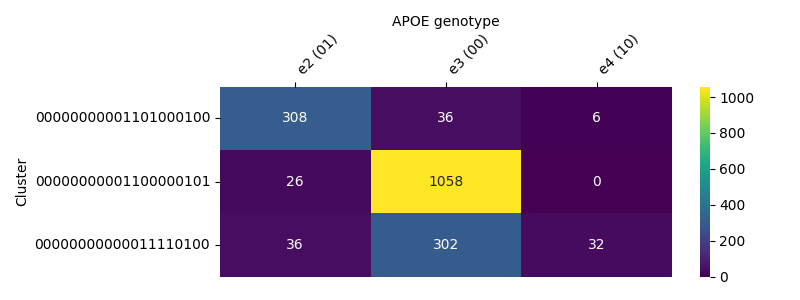

# Genomic Background for Alzheimer’s Disease

This repository follows the workflow from [Haploblock Clusters ElixirBH25](https://github.com/collaborativebioinformatics/Haploblock_Clusters_ElixirBH25).

## Haploblocks in Chromosome 19

- Identified **1006 haploblocks** on chromosome 19.  
- One haploblock of interest: `chr19:44,885,589-44,935,297`, which **contains the APOE gene** (`chr19:44,905,791-44,909,393`).  
- The **APOE gene (~4 kb)** is in the middle of the haploblock (~50 kb).

## Clustering APOE Sequences

- APOE sequences from **26 populations in the 1000 Genomes Project** were clustered.  
- Total clusters: **295 clusters with multiple individuals**, plus **601 clusters with only 1 individual**.  

### Representative Clusters

| Cluster Representative | # Sequences |
|-----------------------|-------------|
| NA19651_chr19_region_44885589-44935297_hap0 | 1084 |
| NA18984_chr19_region_44885589-44935297_hap0 | 370 |
| HG03755_chr19_region_44885589-44935297_hap0 | 355 |
| HG02151_chr19_region_44885589-44935297_hap0 | 351 |
| HG02586_chr19_region_44885589-44935297_hap1 | 258 |
| HG01479_chr19_region_44885589-44935297_hap0 | 148 |
| … | … |

## APOE Haplotype Summary (1000 Genomes)

| APOE Genotype | # Individuals |
|---------------|---------------|
| ε3/ε3 | 1525 |
| ε3/ε4 | 547 |
| ε2/ε3 | 282 |
| ε4/ε4 | 70 |
| ε2/ε4 | 65 |
| ε2/ε2 | 14 |
| Unknown | 1 |

We generated **genomic hashes** for AD-associated SNPs in APOE (from the [GWAS Catalog](https://www.ebi.ac.uk/gwas/)).
- Check if **clusters correspond to APOE subtypes**.
  - If yes, great.  
  - If not, verify whether hashes correspond to genomic backgrounds explaining **differential outcomes in AD**.

We generated a **heatmap**: cluster ID vs APOE alleles (1/2/3/4). A part of the heatmap:

## Extending to Biobank Data

- Define **population-scale nomenclature** for haploblock clusters.  
- Subtype **multiple phenotypes**, including Alzheimer’s disease and cancer.  
- Requires **genotype and phenotype data** to train a foundation model for **background genotype-phenotype mapping** (representation learning).
