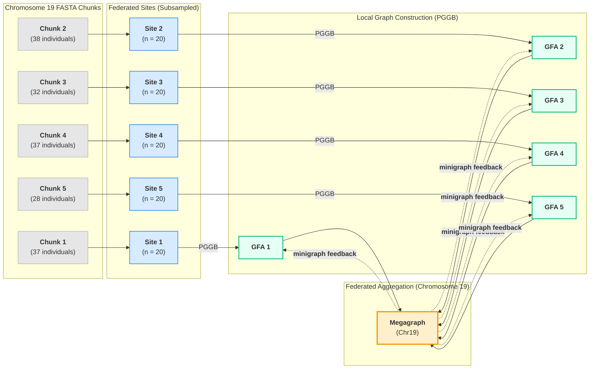

# Federated Pangenome Graph Construction


---

---
## 🧬 Overview

This project implements a **federated approach to pangenome graph construction**, enabling privacy-preserving collaborative genomic analysis across distributed sites. The methodology simulates federated learning principles applied to pangenome construction, where raw sequence data remains local while graph representations are shared and aggregated.

### Key Innovation

Traditional pangenome construction requires centralizing all genomic data. Our federated approach:
- **Keeps raw FASTA data local** at each site (privacy preserved)
- **Shares only graph representations** (GFA files)
- **Aggregates graphs centrally** into a MEGAGRAPH
- **Feeds global knowledge back** to improve local graphs

This mirrors federated machine learning where model weights are shared instead of raw training data.

> ⚠️ **Important**: Graphs are combined **per chromosome only**. Chr19 graphs combine with Chr19 graphs. Chr22 graphs combine with Chr22 graphs. **Never combine across chromosomes.**

---

## 🏗️ Architecture

### Workflow Diagram

```
═══════════════════════════════════════════════════════════════════════════════
                    FEDERATED PANGENOME CONSTRUCTION WORKFLOW
═══════════════════════════════════════════════════════════════════════════════

INPUT: Chromosome-specific chunks (e.g., Chr19)
───────────────────────────────────────────────────────────────────────────────

/mnt/shared_vol/hprc_mini_fasta/
├── chrom19_chunk1.fa.gz (37 individuals)
├── chrom19_chunk2.fa.gz (38 individuals)
├── chrom19_chunk3.fa.gz (32 individuals)
├── chrom19_chunk4.fa.gz (37 individuals)
└── chrom19_chunk5.fa.gz (28 individuals)


STEP 0: SUBCHUNKING (First 20 individuals from each chunk)
───────────────────────────────────────────────────────────────────────────────

chrom19_chunk1.fa.gz ──► chr19_chunk1_sub20.fa.gz (Site 1: 20 individuals)
chrom19_chunk2.fa.gz ──► chr19_chunk2_sub20.fa.gz (Site 2: 20 individuals)
chrom19_chunk3.fa.gz ──► chr19_chunk3_sub20.fa.gz (Site 3: 20 individuals)
chrom19_chunk4.fa.gz ──► chr19_chunk4_sub20.fa.gz (Site 4: 20 individuals)
chrom19_chunk5.fa.gz ──► chr19_chunk5_sub20.fa.gz (Site 5: 20 individuals)


STEP 1: LOCAL GRAPH CONSTRUCTION (PGGB)
───────────────────────────────────────────────────────────────────────────────
Each site builds its own pangenome graph independently

  SITE 1              SITE 2              SITE 3              SITE 4              SITE 5
     │                   │                   │                   │                   │
     ▼                   ▼                   ▼                   ▼                   ▼
┌──────────┐       ┌──────────┐       ┌──────────┐       ┌──────────┐       ┌──────────┐
│ chunk1   │       │ chunk2   │       │ chunk3   │       │ chunk4   │       │ chunk5   │
│  (FASTA) │       │  (FASTA) │       │  (FASTA) │       │  (FASTA) │       │  (FASTA) │
└────┬─────┘       └────┬─────┘       └────┬─────┘       └────┬─────┘       └────┬─────┘
     │ PGGB             │ PGGB             │ PGGB             │ PGGB             │ PGGB
     ▼                   ▼                   ▼                   ▼                   ▼
┌──────────┐       ┌──────────┐       ┌──────────┐       ┌──────────┐       ┌──────────┐
│   GFA1   │       │   GFA2   │       │   GFA3   │       │   GFA4   │       │   GFA5   │
└──────────┘       └──────────┘       └──────────┘       └──────────┘       └──────────┘


STEP 2: GRAPH AGGREGATION (vg combine) - SAME CHROMOSOME ONLY
───────────────────────────────────────────────────────────────────────────────

    GFA1          GFA2          GFA3          GFA4          GFA5
    (Chr19)       (Chr19)       (Chr19)       (Chr19)       (Chr19)
      │             │             │             │             │
      └─────────────┴──────┬──────┴─────────────┴─────────────┘
                           │
                    vg convert (GFA → VG)
                    vg combine -p
                           │
                           ▼
                   ┌───────────────┐
                   │  MEGAGRAPH    │
                   │   (Chr19)     │
                   └───────────────┘


STEP 3: FEEDBACK LOOP (minigraph)
───────────────────────────────────────────────────────────────────────────────

                    MEGAGRAPH.gfa (Chr19)
                           │
        ┌──────────────────┼──────────────────┐
        │          │       │       │          │
        ▼          ▼       ▼       ▼          ▼
    chunk1.fa  chunk2.fa  ...  chunk4.fa  chunk5.fa
        │          │       │       │          │
        │ minigraph│       │       │          │
        ▼          ▼       ▼       ▼          ▼
     GFA1'      GFA2'   GFA3'   GFA4'      GFA5'
   (improved) (improved)     (improved) (improved)
```

---

## 🛠️ Tools Used

| Tool | Purpose | Stage |
|------|---------|-------|
| **PGGB** | Build base-level pangenome graphs from FASTA | Step 1 |
| **vg combine** | Merge multiple graphs into MEGAGRAPH | Step 2 |
| **vg convert** | Convert between GFA and VG formats | Step 2 |
| **minigraph** | Incremental graph construction for feedback | Step 3 |
| **samtools** | FASTA indexing | Preprocessing |
| **bgzip** | Block compression for indexed FASTA | Preprocessing |

### Tool Comparison

| Feature | PGGB | minigraph |
|---------|------|-----------|
| Resolution | Base-level (SNPs, indels, SVs) | SV-only (≥50bp) |
| Speed | Slower (hours) | Fast (seconds) |
| Input | FASTA only | FASTA or GFA |
| Incremental | No (full rebuild) | Yes (native) |
| Use Case | High-quality local graphs | Fast aggregation/feedback |

---

## 📁 Directory Structure

```
/mnt/shared_vol/
├── hprc_mini_fasta/                    # Input data
│   ├── chrom19_chunk1.fa.gz            # Original chunks (bgzip format)
│   ├── chrom19_chunk2.fa.gz
│   ├── chrom19_chunk3.fa.gz
│   ├── chrom19_chunk4.fa.gz
│   ├── chrom19_chunk5.fa.gz
│   ├── chrom22_chunk1.fa.gz            # Chr22 (processed separately)
│   ├── chrom22_chunk2.fa.gz
│   ├── chrom22_chunk3.fa.gz
│   │
│   └── subchunks/                      # Step 0 output
│       ├── chr19_chunk1_sub20.fa.gz    # bgzip compressed
│       ├── chr19_chunk1_sub20.fa.gz.fai # samtools index
│       ├── chr19_chunk2_sub20.fa.gz
│       ├── chr19_chunk2_sub20.fa.gz.fai
│       └── ...
│
└── graphs/                             # Output directory
    ├── docker_pipeline/                # Pipeline code
    │   ├── Dockerfile
    │   ├── federated_pangenome_pipeline.py
    │   └── run_pggb_only.sh
    │
    ├── chr19_chunk1_sub20/             # Step 1: PGGB outputs
    │   └── *.smooth.final.gfa
    ├── chr19_chunk2_sub20/
    ├── chr19_chunk3_sub20/
    ├── chr19_chunk4_sub20/
    ├── chr19_chunk5_sub20/
    │
    ├── MEGAGRAPH.vg                    # Step 2: Combined graph
    ├── MEGAGRAPH.gfa
    │
    ├── federated/                      # Step 3: Improved graphs
    │   ├── chr19_chunk1_sub20_federated.gfa
    │   ├── chr19_chunk2_sub20_federated.gfa
    │   ├── chr19_chunk3_sub20_federated.gfa
    │   ├── chr19_chunk4_sub20_federated.gfa
    │   └── chr19_chunk5_sub20_federated.gfa
    │
    └── pggb_run.log                    # Execution log
```

---

## 🚀 Quick Start

### Prerequisites

- Docker
- Access to shared volume with HPRC data
- ~50GB disk space for outputs
- **tabix** (provides bgzip for compression)
- **samtools** (for FASTA indexing)

```bash
# Install prerequisites
apt-get update && apt-get install -y tabix samtools
```

### Running the Pipeline

```bash
# Navigate to pipeline directory
cd /mnt/shared_vol/graphs/docker_pipeline

# Run PGGB on all chunks (background)
nohup ./run_pggb_only.sh > pggb_run.log 2>&1 &

# Monitor progress
tail -f pggb_run.log

# Check status
ps aux | grep pggb
```

---

## 📊 Data Format

### Input FASTA Format (PanSN Naming)

```
>HG00097#1#HG00097#1#CM094070.1
ACTGACTGACTG...
>HG00097#2#HG00097#2#CM094085.1
ACTGACTGACTG...
```

Format: `>SampleID#Haplotype#SampleID#Haplotype#Accession`

- Each individual has 2 haplotypes (#1 and #2)
- Files must have **complete diploid pairs** (both haplotypes present)

### ⚠️ Critical: BGZIP Requirement

> **PGGB requires bgzip format, NOT regular gzip!**

Regular gzip files will fail with:
```
[E::fai_build3_core] Cannot index files compressed with gzip, please use bgzip
```

### File Preparation

```bash
# Convert gzip → bgzip + index
gunzip -c input.fa.gz > input.fa    # Decompress
bgzip input.fa                       # Recompress with bgzip
samtools faidx input.fa.gz           # Create index

# Verify both files exist
ls -la input.fa.gz input.fa.gz.fai
```

### Output GFA Format

```
H	VN:Z:1.0
S	1	ACTGACTG...
S	2	GCTAGCTA...
L	1	+	2	+	0M
P	HG00097#1	1+,2+	*
```

---

## ⚙️ Configuration

Edit `federated_pangenome_pipeline.py` to modify:

```python
# Configuration
INPUT_DIR = "/mnt/shared_vol/hprc_mini_fasta"
SUBCHUNK_DIR = "/mnt/shared_vol/hprc_mini_fasta/subchunks"
OUTPUT_DIR = "/mnt/shared_vol/graphs"
NUM_INDIVIDUALS = 20  # Individuals per subchunk (set to 10 for faster runs)
NUM_THREADS = 8       # CPU threads for PGGB
```

---

## 🔬 Scientific Background

### Why Federated?

In real-world genomics:
- **Privacy regulations** (GDPR, HIPAA) restrict data sharing
- **Data sovereignty** requires data to stay within institutions
- **Large datasets** are expensive to transfer

Our federated approach enables:
- Multi-institutional collaboration
- Privacy-preserving analysis
- Scalable pangenome construction

### Comparison to Federated ML

| Federated ML | Federated Pangenome |
|--------------|---------------------|
| Local model training | Local PGGB graph construction |
| Share model weights | Share GFA graphs |
| Server aggregates weights | Server combines graphs (vg combine) |
| Updated weights sent back | MEGAGRAPH fed back (minigraph) |
| Raw data stays local | Raw FASTA stays local |

---

## 📈 Expected Performance

| Step | Duration | Output Size |
|------|----------|-------------|
| Step 0: Subchunking | 10-30 min | ~280MB each |
| Step 1: PGGB (×5 chunks) | 2-10 hours | ~1-5GB each |
| Step 2: vg combine | 30-60 min | ~5-20GB |
| Step 3: minigraph feedback | 30 min | ~1-5GB each |

**Total estimated time: 4-12 hours** (depending on data size and hardware)

---

## 🐛 Troubleshooting

### PGGB fails with "Cannot index files compressed with gzip"

```bash
# Files must be bgzip format, not regular gzip
gunzip -c file.fa.gz > file.fa
bgzip file.fa
samtools faidx file.fa.gz
```

### PGGB fails with "index does not exist"

```bash
# Create index with samtools
samtools faidx your_file.fa.gz

# Verify .fai file exists
ls -la your_file.fa.gz.fai
```

### Container not starting

```bash
# Check Docker daemon
systemctl status docker

# Remove old container and retry
docker rm -f federated_pangenome_pipeline
./run_pipeline.sh
```

### S3FS slow performance

```bash
# Copy files to local disk for faster processing
cp /mnt/shared_vol/hprc_mini_fasta/*.fa.gz /home/ubuntu/local_data/
```

### PGGB memory issues

```bash
# Reduce individuals per subchunk
# Edit federated_pangenome_pipeline.py:
NUM_INDIVIDUALS = 10  # Instead of 20
```

### Check logs

```bash
# PGGB run log
tail -100 /mnt/shared_vol/graphs/docker_pipeline/pggb_run.log

# Docker logs (if using containerized pipeline)
docker logs federated_pangenome_pipeline | tail -100
```

---

## 📋 Step-by-Step Manual Execution

If the automated pipeline fails, run each step manually:

```bash
# ═══════════════════════════════════════════════════════════════
# STEP 0: Create subchunks (first 20 individuals from each chunk)
# ═══════════════════════════════════════════════════════════════
cd /mnt/shared_vol/hprc_mini_fasta
mkdir -p subchunks

for i in 1 2 3 4 5; do
  # Extract first 20 sequences
  zcat chrom19_chunk${i}.fa.gz | awk '/^>/{n++} n<=20{print}' > subchunks/chr19_chunk${i}_sub20.fa
  
  # Compress with bgzip (NOT gzip!)
  bgzip subchunks/chr19_chunk${i}_sub20.fa
  
  # Create index
  samtools faidx subchunks/chr19_chunk${i}_sub20.fa.gz
done

# ═══════════════════════════════════════════════════════════════
# STEP 1: Run PGGB on each subchunk
# ═══════════════════════════════════════════════════════════════
for i in 1 2 3 4 5; do
  mkdir -p /mnt/shared_vol/graphs/chr19_chunk${i}_sub20
  N=$(zcat subchunks/chr19_chunk${i}_sub20.fa.gz | grep -c '^>')
  
  docker run --rm \
    -v /mnt/shared_vol/hprc_mini_fasta/subchunks:/data \
    -v /mnt/shared_vol/graphs/chr19_chunk${i}_sub20:/output \
    ghcr.io/pangenome/pggb:latest \
    pggb -i /data/chr19_chunk${i}_sub20.fa.gz \
         -o /output \
         -n ${N} \
         -t 8 \
         -p 90 \
         -s 10000
done

# ═══════════════════════════════════════════════════════════════
# STEP 2: Combine graphs with vg
# ═══════════════════════════════════════════════════════════════
# Convert each GFA to VG and combine
# (Run after all PGGB jobs complete)

# ═══════════════════════════════════════════════════════════════
# STEP 3: Feedback with minigraph
# ═══════════════════════════════════════════════════════════════
# minigraph -cxggs MEGAGRAPH.gfa chunk.fa > improved.gfa
```

---

## 👥 Team

**CMU x NVIDIA Hackathon 2026**

- Kumar Koushik Telaprolu (Carnegie Mellon University; Indiana University Bloomington)
- [Other team members]

---

## 📚 References

1. **PGGB**: Garrison E, et al. "Building pangenome graphs." *bioRxiv* (2023)
2. **vg**: Garrison E, et al. "Variation graph toolkit improves read mapping." *Nature Biotechnology* (2018)
3. **minigraph**: Li H, et al. "The design and construction of reference pangenome graphs." *Genome Biology* (2020)
4. **HPRC**: Human Pangenome Reference Consortium. "A draft human pangenome reference." *Nature* (2023)

---

## 📄 License

MIT License

---

## 🔗 Links

- [GitHub Repository](https://github.com/collaborativebioinformatics/Pangenome_and_Genomic_Cluster_Modeling)
- [PGGB Documentation](https://github.com/pangenome/pggb)
- [vg Documentation](https://github.com/vgteam/vg)
- [minigraph Documentation](https://github.com/lh3/minigraph)
